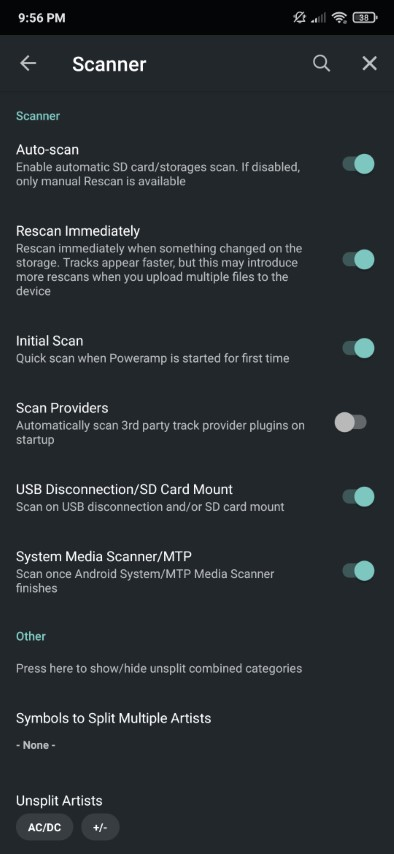

I'm not a native english speaker. Please don't mind my "not very good" English.

This script is use to sync playlist from jellyfin (and probably emby) to any other application (with a few modifications to suit your needs).

I developed it to approach the functioning of the missed google play music.

Goals (my needs) :
- synchronize my playlists from my jellyfin installation to my mobile
- Be easy to use on saily basis with my default audio player [poweramp](https://play.google.com/store/apps/details?id=com.maxmpz.audioplayer&hl=fr&gl=US)

# How does it works ?
- The script parses all jellyfin playlists files
- A symbolic link is created for each file in the playlist
- A m3u8 file is generated for the playlist
- All files are made available on a samba share
- All the files are synchronized on mobile by a dedicated application ([foldersync](https://play.google.com/store/apps/details?id=dk.tacit.android.foldersync.lite&hl=fr&gl=US))

# Benefits
- Simple to install and to use
- You can use it as inspiration to adapt to your needs
- No file duplication, everything is symbolic links (very small storage fingerprint). A file in multiple playlists will be only downloaded once

# Downside
- Not as simple as google play music (but better than what exists at the moment (which is nothing at all))
- Can't listen online music without jellyfin application
- Perfectly suited for my use (so not for everyone. However the method is flexible enough to meet all needs with a little work)
- Not (yet) cross devices

#Installation
## Dependancies
    
    pip3 install fire

## Programme files
Simply copy the two files where you want :
- `playlists_sync.py`
- `playlists_sync_params.py`

## Service files

Place the file `jellyfin_playlists_sync.service` in `/usr/lib/systemd/system/` (and replace the `WorkingDirectory` parameter)

```
#This file must be placed in /usr/lib/systemd/system/

[Unit]
Description=Jellyfin playlists sync service
After=network.target

[Service]
type=simple
RemainAfterExit=yes

User=root
Group=root

# The directory where you downloaded this program
WorkingDirectory={{ path where you installed the two py files }}
ExecStart=python3 playlists_sync.py scan

[Install]
WantedBy=multi-user.target
```

### Timer file

If you want to launch the script periodically, copy the file `jellyfin_playlists_sync.timer` in `/usr/lib/systemd/system/`

```
[Unit]
Description=Sync playlists automatically

[Timer]
OnCalendar=23:45:00

[Install]
WantedBy=timers.target
```

## Usage
```
systemctl status jellyfin_playlists_sync # see logs
systemctl start jellyfin_playlists_sync # run the script once
systemctl enable jellyfin_playlists_sync.timer # start the periodically launch of the script
systemctl disable jellyfin_playlists_sync.timer # stop the periodically launch of the script
```

## Parameters
Don't forget to change the parameters or it will not work !

### Know where the files are located on your mobile
You can export a local playlist to see how the file is built.

# Trigger
You can trigger the script as you want. Python script, telegram bot, jenkins, ansible, …

I personally chose a daily launch with the possibility to launch it manually from my telegram bot.

# FolderSync configuration
## Link an account
On the "account" tab, add a SMB2 account and fill the informations


## Folderpairs
On the "folderpairs" tab, add a synchronization pair and set parameters as you want.


### Advices
- Sync type : to local folder
- Sync subfolders : yes
- Sync deletions : yes
- Local folder : a dedicated folder to put all the downloaded files
- Scheduling : as you want

### Synchronize

You can synchronize folder by clicking "sync" in the "folderpairs" tab


# Poweramp
Select source forders by clicking the three dots on top right of the library tab then "select folders" then "+" and select the folder you download files ("Local folder" in folderpairs configuration)

All your files will be well stored and your playlists will be available and usable.


# Reload library
You can click "rescan" on the three dots menu  on top right of the library tab or


## Enable auto reload
Go in poweramp settings > library > scanner > "rescan immediatly"



# Troubleshouting
## Samba symlink configuration
To allow samba to follow wymbolic links outside samba shares, you must add this parameter in your global parameters of samba :

```
# /etc/samba/smb.conf

[global]
    allow insecure wide links = yes
```

On the selected share :

```
# /etc/samba/smb.conf

[Playlists]
	path = {{ playlist directory to share }}
    follow symlinks = yes
    wide links = yes
```

## Something is wrong
Check step by step where the problem occurs :
- access to playlist files
- access to data folder (where all links will be added)
- all the files are available on the samba share
- all the files are playable
- the m3u8 file is properly formated
- everything is correctly downloaded on your mobile
- the audio files correctly appears in poweramp
- the audio files path for your mobile is correct